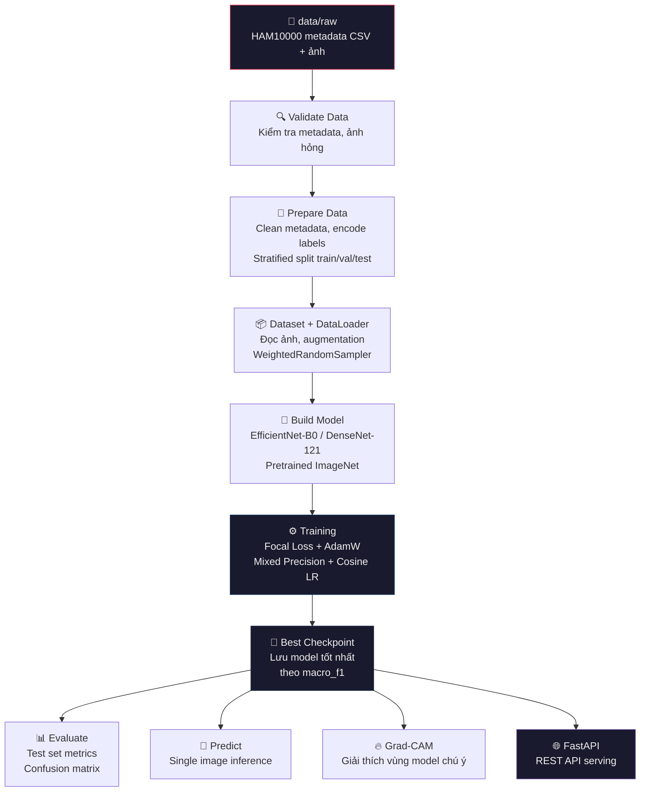
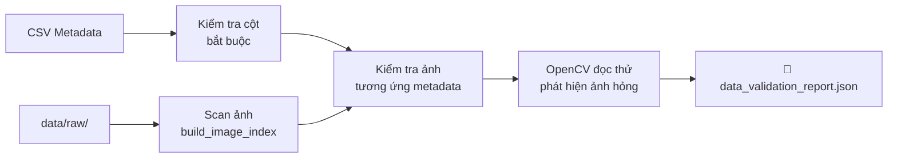
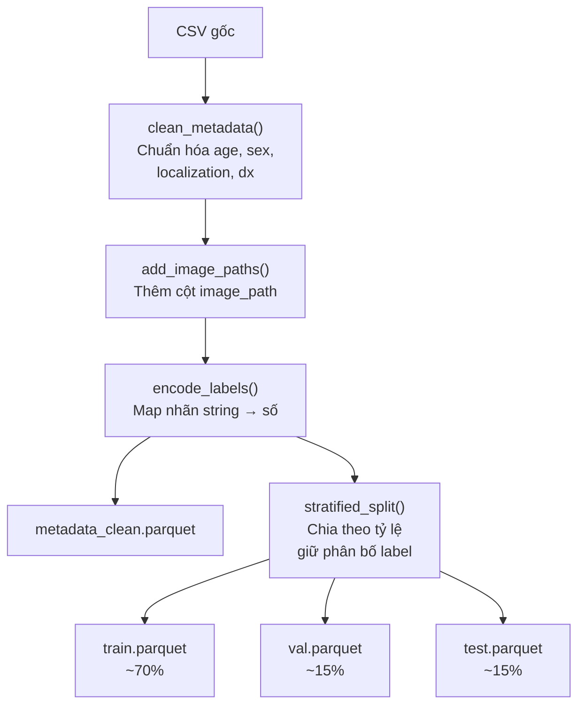
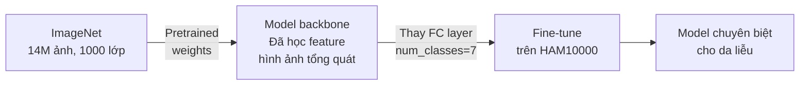
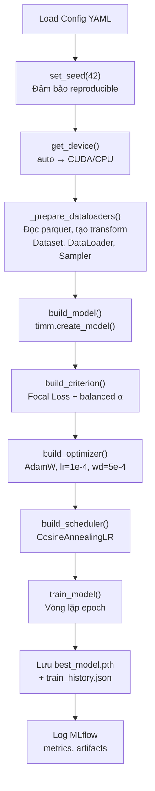
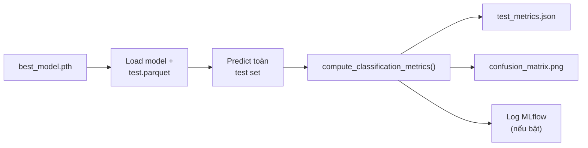
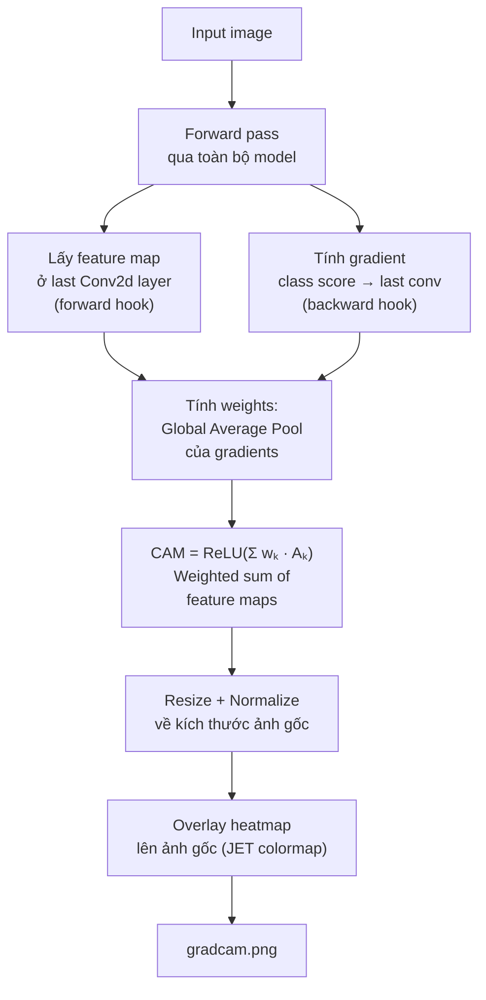
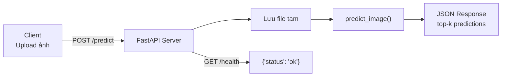
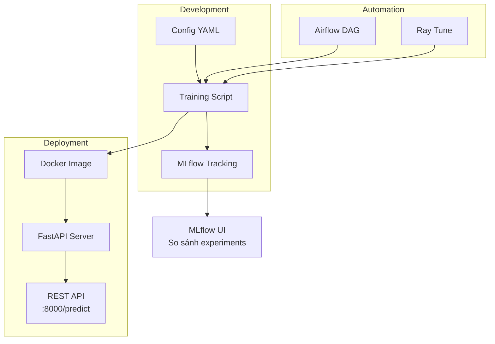

# BÁO CÁO DỰ ÁN: Phân Loại Ung Thư Da với Deep Learning

## Hệ Thống Phân Loại Tổn Thương Da HAM10000

---

## Mục lục

1. [Giới thiệu bài toán](#1-giới-thiệu-bài-toán)
2. [Tổng quan kiến trúc hệ thống](#2-tổng-quan-kiến-trúc-hệ-thống)
3. [Bộ dữ liệu HAM10000](#3-bộ-dữ-liệu-ham10000)
4. [Pipeline xử lý dữ liệu](#4-pipeline-xử-lý-dữ-liệu)
5. [Mô hình Deep Learning](#5-mô-hình-deep-learning)
6. [Xử lý dữ liệu mất cân bằng](#6-xử-lý-dữ-liệu-mất-cân-bằng)
7. [Training Pipeline](#7-training-pipeline)
8. [Đánh giá mô hình](#8-đánh-giá-mô-hình)
9. [Giải thích dự đoán — Grad-CAM](#9-giải-thích-dự-đoán--grad-cam)
10. [Triển khai và phục vụ (Serving)](#10-triển-khai-và-phục-vụ-serving)
11. [MLOps](#11-mlops)
12. [Cấu trúc mã nguồn](#12-cấu-trúc-mã-nguồn)
13. [Kết luận](#13-kết-luận)

---

## 1. Giới thiệu bài toán

### 1.1 Bối cảnh

Ung thư da là một trong những loại ung thư phổ biến nhất trên thế giới. Việc **chẩn đoán sớm** đóng vai trò quyết định trong điều trị thành công. Tuy nhiên, phân loại tổn thương da bằng mắt thường có tỷ lệ sai sót cao, ngay cả với bác sĩ da liễu có kinh nghiệm.

### 1.2 Mục tiêu

Xây dựng hệ thống **phân loại tự động** 7 loại tổn thương da từ ảnh dermoscopy, sử dụng deep learning:

| Mã | Tên đầy đủ | Tính chất |
|---|---|---|
| `akiec` | Actinic Keratoses / Intraepithelial Carcinoma | ⚠️ Ác tính |
| `bcc` | Basal Cell Carcinoma | ⚠️ Ác tính |
| `bkl` | Benign Keratosis-like Lesions | Lành tính |
| `df` | Dermatofibroma | Lành tính |
| `mel` | Melanoma | ⚠️ Ác tính |
| `nv` | Melanocytic Nevi | Lành tính |
| `vasc` | Vascular Lesions | Lành tính |

> [!IMPORTANT]
> Ba loại ác tính (`akiec`, `bcc`, `mel`) đặc biệt quan trọng — bỏ sót melanoma (`mel`) có thể đe dọa tính mạng bệnh nhân. Do đó, **recall của mel** là metric được theo dõi chặt.

### 1.3 Tech Stack

| Thành phần | Công nghệ |
|---|---|
| Deep Learning Framework | **PyTorch** |
| Model Architecture | **timm** (EfficientNet-B0, DenseNet-121) |
| Data Augmentation | **Albumentations** |
| Experiment Tracking | **MLflow** |
| Hyperparameter Tuning | **Ray Tune** |
| API Serving | **FastAPI + Uvicorn** |
| Orchestration | **Apache Airflow** |
| Container | **Docker + Docker Compose** |
| Testing | **pytest** |

---

## 2. Tổng quan kiến trúc hệ thống

### 2.1 Pipeline tổng thể



### 2.2 Luồng lệnh thực thi

```bash
# Bước 1: Kiểm tra dữ liệu thô
make validate

# Bước 2: Chuẩn bị dữ liệu (clean + split)
make prepare

# Bước 3: Huấn luyện mô hình
make train

# Bước 4: Đánh giá trên tập test
make evaluate

# Bước 5: Dự đoán một ảnh
make predict IMAGE=path/to/image.jpg

# Bước 6: Giải thích dự đoán
make gradcam IMAGE=path/to/image.jpg

# Bước 7: Chạy API server
make serve
```

---

## 3. Bộ dữ liệu HAM10000

### 3.1 Tổng quan

**HAM10000** (*Human Against Machine with 10000 training images*) là bộ dữ liệu dermoscopy gồm ~10,015 ảnh tổn thương da, được thu thập từ nhiều bệnh viện.

### 3.2 Đặc điểm

- **Số lượng ảnh**: ~10,015
- **Số lớp**: 7 loại tổn thương
- **Định dạng ảnh**: JPG
- **Metadata**: `image_id`, `dx` (chẩn đoán), `dx_type`, `age`, `sex`, `localization`

### 3.3 Vấn đề mất cân bằng dữ liệu

Đây là thách thức lớn nhất của bộ dữ liệu:

```
Phân bố các lớp (ước tính):
═══════════════════════════════════════════════════
nv     ████████████████████████████████████  ~67%  (6705 ảnh)
mel    ████                                 ~11%  (1113 ảnh)
bkl    ████                                 ~11%  (1099 ảnh)
bcc    ██                                   ~5%   (514 ảnh)
akiec  █                                    ~3%   (327 ảnh)
vasc   ▌                                    ~1%   (142 ảnh)
df     ▌                                    ~1%   (115 ảnh)
═══════════════════════════════════════════════════
```

> [!WARNING]
> Lớp `nv` chiếm ~67%, trong khi `df` và `vasc` chỉ ~1%. Nếu không xử lý, model sẽ bias mạnh về `nv` và bỏ sót các lớp hiếm — đặc biệt nguy hiểm với melanoma.

---

## 4. Pipeline xử lý dữ liệu

### 4.1 Bước 1: Validation — Kiểm tra dữ liệu thô

📄 **File**: [validation.py](file:///d:/Hoc/skin-cancer-classification-v3/src/skin_cancer/data/validation.py)



| Hàm | Chức năng |
|---|---|
| `build_image_index()` | Quét `data/raw/` tạo mapping `image_id → path` |
| `validate_metadata_columns()` | Kiểm tra CSV có đủ cột `image_id`, `dx` |
| `validate_image_paths()` | Mỗi dòng metadata phải có file ảnh tương ứng |
| `validate_corrupted_images()` | Dùng OpenCV đọc thử, phát hiện ảnh hỏng/corrupt |

### 4.2 Bước 2: Preparation — Tiền xử lý dữ liệu

📄 **File**: [preparation.py](file:///d:/Hoc/skin-cancer-classification-v3/src/skin_cancer/data/preparation.py)



**Chi tiết từng bước:**

1. **`clean_metadata()`**: Chuẩn hóa `image_id` thành string, `dx` thành lowercase, fill tuổi bị thiếu bằng median, sex/localization fill `"unknown"`.

2. **`encode_labels()`**: Map nhãn string sang số theo thứ tự trong config:
   ```
   akiec → 0, bcc → 1, bkl → 2, df → 3, mel → 4, nv → 5, vasc → 6
   ```

3. **`stratified_split()`**: Dùng `sklearn.train_test_split` với `stratify=label` — đảm bảo tỷ lệ mỗi lớp được giữ nguyên trong cả 3 tập.

### 4.3 Bước 3: Dataset & DataLoader

📄 **File**: [dataset.py](file:///d:/Hoc/skin-cancer-classification-v3/src/skin_cancer/data/dataset.py)

**`SkinLesionDataset`** — Custom PyTorch Dataset:

```python
# Luồng xử lý mỗi sample:
image_path → OpenCV đọc ảnh (BGR) → Chuyển RGB → Apply transform → (tensor, label)
```

📄 **File**: [transforms.py](file:///d:/Hoc/skin-cancer-classification-v3/src/skin_cancer/data/transforms.py)

### 4.4 Data Augmentation

Dùng **Albumentations** để tăng cường dữ liệu training, giúp model generalize tốt hơn:

| Kỹ thuật | Xác suất | Mô tả |
|---|---|---|
| **Resize** | 100% | Resize về `image_size × image_size` (224 hoặc 300) |
| **HorizontalFlip** | 50% | Lật ngang ảnh |
| **VerticalFlip** | 30% | Lật dọc ảnh |
| **Rotate** | 50% | Xoay ngẫu nhiên ±30° |
| **ShiftScaleRotate** | 50% | Dịch, scale, xoay đồng thời |
| **RandomBrightnessContrast** | 50% | Thay đổi độ sáng và tương phản |
| **Normalize** | 100% | Normalize theo ImageNet mean/std |

```python
# ImageNet normalization constants
IMAGENET_MEAN = (0.485, 0.456, 0.406)
IMAGENET_STD  = (0.229, 0.224, 0.225)
```

> [!NOTE]
> **Tại sao dùng ImageNet normalization?** Vì model pretrained được train trên ImageNet với các giá trị mean/std này. Để tận dụng transfer learning, dữ liệu đầu vào phải được normalize giống cách ImageNet được normalize.

**Validation/Test transform** chỉ Resize + Normalize (không augment), để đánh giá trung thực.

---

## 5. Mô hình Deep Learning

### 5.1 Transfer Learning

Dự án sử dụng chiến lược **Transfer Learning** — lấy model đã pretrained trên **ImageNet** (14 triệu ảnh, 1000 lớp) rồi **fine-tune** lại cho bài toán 7 lớp tổn thương da.



📄 **File**: [model.py](file:///d:/Hoc/skin-cancer-classification-v3/src/skin_cancer/modeling/model.py)

```python
def build_model(model_name: str, num_classes: int, pretrained: bool = True) -> nn.Module:
    model = timm.create_model(model_name, pretrained=pretrained, num_classes=num_classes)
    return model
```

> **`timm.create_model()`** tự động: (1) Tải kiến trúc model, (2) Download pretrained weights, (3) Thay lớp classifier cuối với `num_classes=7`.

### 5.2 EfficientNet-B0

**Bài báo**: *"EfficientNet: Rethinking Model Scaling for CNNs"* — Tan & Le, Google 2019

#### Ý tưởng: Compound Scaling

Thay vì scale CNN theo một chiều, EfficientNet scale **đồng thời 3 chiều** theo tỷ lệ cố định:

```
depth (số layer):     d = α^φ
width (số channel):   w = β^φ  
resolution (ảnh):     r = γ^φ

Ràng buộc: α · β² · γ² ≈ 2
```

#### Kiến trúc

```
Input (224×224×3)
    ↓
┌───────────────────────────┐
│ Stem: Conv3×3 + BN + Swish│
└───────────────────────────┘
    ↓
┌───────────────────────────┐
│ 7 Stages MBConv Blocks    │
│                           │
│ MBConv = Inverted Residual│
│        + Squeeze-Excite   │
│        + Depthwise Conv   │
│        + Swish activation │
└───────────────────────────┘
    ↓
┌───────────────────────────┐
│ Head: Conv1×1 → 1280 ch   │
│ Global Average Pooling    │
│ FC → 7 classes            │
└───────────────────────────┘
```

| Thông số | Giá trị |
|---|---|
| Parameters | **~5.3M** |
| FLOPs | ~0.39B |
| Input size (project) | **224 × 224** |
| ImageNet Top-1 | 77.1% |

### 5.3 DenseNet-121

**Bài báo**: *"Densely Connected Convolutional Networks"* — Huang et al., CVPR 2017 (Best Paper)

#### Ý tưởng: Dense Connection

Mỗi layer nhận feature maps từ **TẤT CẢ** các layer trước đó (concatenation):

```
ResNet:    output = F(x) + x           ← Cộng (addition)
DenseNet:  output = H([x₀, x₁, ..., xₗ])  ← Nối (concatenation)
```

**Lợi ích:**
- **Feature reuse tối đa** — không layer nào bị "quên"
- **Gradient flow mạnh** — mỗi layer có direct path tới loss
- **Ít tham số** — mỗi layer chỉ tạo `k=32` feature maps mới (growth rate)

#### Kiến trúc

```
Input (300×300×3)        ← Project dùng 300×300 cho DenseNet
    ↓
┌────────────────────────┐
│ Conv 7×7 + BN + ReLU   │
│ MaxPool 3×3            │
└────────────────────────┘
    ↓
┌────────────────────────┐
│ Dense Block 1 (6 layers)│
│ Transition Layer 1     │
│ Dense Block 2 (12 layers│
│ Transition Layer 2     │
│ Dense Block 3 (24 layers│
│ Transition Layer 3     │
│ Dense Block 4 (16 layers│
└────────────────────────┘
    ↓
┌────────────────────────┐
│ Global Average Pooling │
│ FC → 7 classes         │
└────────────────────────┘
```

> **121** = 1 conv đầu + (6+12+24+16) layers + 3 transitions + 1 FC

| Thông số | Giá trị |
|---|---|
| Parameters | **~8.0M** |
| FLOPs | ~2.87B |
| Input size (project) | **300 × 300** |
| Growth rate | 32 |

### 5.4 So sánh hai model

| Tiêu chí | EfficientNet-B0 | DenseNet-121 |
|---|---|---|
| **Năm** | 2019 | 2017 |
| **Ý tưởng** | Compound Scaling + NAS | Dense Connection |
| **Block** | MBConv (Inverted Residual + SE) | BN-ReLU-Conv Bottleneck |
| **Connection** | Skip (add) | Dense (concat) |
| **Parameters** | ~5.3M ✅ | ~8.0M |
| **FLOPs** | ~0.39B ✅ | ~2.87B |
| **Image size** | 224 | 300 |
| **Batch size khả dụng** | 16-32 | 4-16 (do ảnh lớn hơn) |

---

## 6. Xử lý dữ liệu mất cân bằng

Dự án kết hợp **2 kỹ thuật** để xử lý mất cân bằng:

### 6.1 Focal Loss

📄 **File**: [losses.py](file:///d:/Hoc/skin-cancer-classification-v3/src/skin_cancer/modeling/losses.py)

**Vấn đề**: Cross Entropy coi mọi mẫu ngang nhau → mẫu dễ (nv) vẫn đóng góp loss lớn, "lấn át" mẫu khó (df, vasc).

**Giải pháp**: Focal Loss thêm hệ số `(1 - pₜ)^γ` — **giảm trọng số mẫu dễ**, tập trung vào mẫu khó:

```
FL(pₜ) = -αₜ · (1 - pₜ)^γ · log(pₜ)
```

| Tham số | Ý nghĩa | Giá trị trong project |
|---|---|---|
| `γ (gamma)` | Focusing parameter. γ càng lớn → càng giảm mẫu dễ | 1.0 hoặc 2.0 |
| `α (alpha)` | Class weights. `"balanced"` = tự tính `N/(C×nᵢ)` | `"balanced"` |

```python
class FocalLoss(nn.Module):
    def forward(self, logits, targets):
        ce_loss = F.cross_entropy(logits, targets, weight=self.alpha, reduction="none")
        pt = torch.exp(-ce_loss)                    # pₜ: xác suất đúng
        focal_loss = ((1 - pt) ** self.gamma) * ce_loss  # Giảm loss mẫu dễ
        return focal_loss.mean()
```

**Ví dụ trực quan:**

```
Mẫu dễ (pₜ = 0.95): (1 - 0.95)² × loss = 0.0025 × loss  → gần như bỏ qua
Mẫu khó (pₜ = 0.10): (1 - 0.10)² × loss = 0.81   × loss  → giữ nguyên
```

### 6.2 WeightedRandomSampler

📄 **File**: [train.py](file:///d:/Hoc/skin-cancer-classification-v3/src/skin_cancer/training/train.py) — hàm `build_weighted_sampler()` (line 93-96)

**Cách hoạt động**: Gán xác suất lấy mẫu **tỷ lệ nghịch** với số lượng class:

```python
def build_weighted_sampler(train_df):
    class_counts = train_df["label"].value_counts().to_dict()
    weights = train_df["label"].map(lambda label: 1.0 / class_counts[int(label)])
    return WeightedRandomSampler(weights=weights, num_samples=len(weights), replacement=True)
```

```
nv:   6705 ảnh → weight = 1/6705 = 0.00015  (ít được chọn)
df:    115 ảnh → weight = 1/115  = 0.0087   (58× nhiều hơn nv)
vasc:  142 ảnh → weight = 1/142  = 0.0070   (47× nhiều hơn nv)
```

> [!TIP]
> **Focal Loss** xử lý ở mức **loss** (giảm trọng số mẫu dễ).
> **WeightedRandomSampler** xử lý ở mức **sampling** (oversample class hiếm).
> Hai kỹ thuật bổ trợ nhau, có thể dùng riêng hoặc kết hợp.

---

## 7. Training Pipeline

### 7.1 Luồng Training

📄 **File chính**: [train.py](file:///d:/Hoc/skin-cancer-classification-v3/src/skin_cancer/training/train.py) — hàm `run_training()` (line 198-285)



### 7.2 Vòng lặp Training (Trainer)

📄 **File**: [trainer.py](file:///d:/Hoc/skin-cancer-classification-v3/src/skin_cancer/training/trainer.py)

Mỗi epoch gồm:

```
┌─────────── Epoch k ───────────┐
│                               │
│  1. Train phase               │
│     ├─ model.train()          │
│     ├─ Forward pass           │
│     ├─ Loss + Backward        │
│     ├─ Optimizer step         │
│     └─ Tính metrics           │
│                               │
│  2. Validation phase          │
│     ├─ model.eval()           │
│     ├─ Forward (no grad)      │
│     └─ Tính metrics           │
│                               │
│  3. Scheduler step            │
│  4. Log metrics (MLflow)      │
│  5. Nếu metric tốt hơn best: │
│     └─ save_checkpoint()      │
│                               │
└───────────────────────────────┘
```

### 7.3 Các kỹ thuật tối ưu

| Kỹ thuật | Chi tiết | Lý do |
|---|---|---|
| **Mixed Precision (FP16)** | `torch.cuda.amp.autocast` + `GradScaler` | Tăng tốc ~2× trên GPU, tiết kiệm VRAM |
| **AdamW Optimizer** | lr=1e-4, weight_decay=5e-4 | Adam + decoupled weight decay, phổ biến cho fine-tuning |
| **CosineAnnealingLR** | T_max = epochs | LR giảm dần theo hình cosine, ổn định cuối training |
| **Early Stopping** | patience=5-7 epochs | Dừng sớm nếu metric không cải thiện (config sẵn) |
| **Monitor metric** | `macro_f1` | Cân bằng precision/recall trên mọi lớp |

### 7.4 Cấu hình thí nghiệm

#### EfficientNet-B0 configs (`configs/eff_B0/`)

| Config | Batch | LR | Gamma | Sampler |
|---|---|---|---|---|
| [b0_bs32_gamma2.yaml](file:///d:/Hoc/skin-cancer-classification-v3/configs/eff_B0/b0_bs32_gamma2.yaml) | 32 | 5e-5 | 1.0 | No |
| [b0_bs16_gamma2.yaml](file:///d:/Hoc/skin-cancer-classification-v3/configs/eff_B0/b0_bs16_gamma2.yaml) | 16 | — | 2.0 | — |
| [b0_bs16_gamma1.yaml](file:///d:/Hoc/skin-cancer-classification-v3/configs/eff_B0/b0_bs16_gamma1.yaml) | 16 | 5e-5 | 1.0 | No |

#### DenseNet-121 configs (`configs/densenet121/`)

| Config | Batch | LR | Gamma | Image Size |
|---|---|---|---|---|
| [densenet121_bs8_gamma2.yaml](file:///d:/Hoc/skin-cancer-classification-v3/configs/densenet121/densenet121_bs8_gamma2.yaml) | 16 | 1e-4 | 2.0 | 300 |
| [densenet121_bs4_gamma2.yaml](file:///d:/Hoc/skin-cancer-classification-v3/configs/densenet121/densenet121_bs4_gamma2.yaml) | 4 | — | 2.0 | 300 |

---

## 8. Đánh giá mô hình

### 8.1 Metrics sử dụng

📄 **File**: [metrics.py](file:///d:/Hoc/skin-cancer-classification-v3/src/skin_cancer/evaluation/metrics.py)

| Metric | Công thức | Ý nghĩa |
|---|---|---|
| **Accuracy** | Đúng / Tổng | Tỷ lệ dự đoán đúng tổng thể |
| **Macro Precision** | Trung bình Precision mỗi lớp | Không bị bias bởi lớp lớn |
| **Macro Recall** | Trung bình Recall mỗi lớp | Đo khả năng nhận diện từng lớp |
| **Macro F1** | 2 × P × R / (P + R) macro | **Metric chính để chọn best model** |
| **Weighted F1** | F1 có trọng số theo số mẫu | Metric tham khảo |
| **Macro AUC-OVR** | AUC One-vs-Rest trung bình | Khả năng phân biệt mỗi lớp |
| **Recall (mel)** | TP_mel / (TP_mel + FN_mel) | ⚠️ Quan trọng lâm sàng |
| **F1 (mel)** | F1 riêng cho melanoma | ⚠️ Quan trọng lâm sàng |

### 8.2 Confusion Matrix

📄 **File**: [evaluate.py](file:///d:/Hoc/skin-cancer-classification-v3/src/skin_cancer/evaluation/evaluate.py)

Hệ thống tự động tạo:
- `confusion_matrix.png` — Ma trận nhầm lẫn (giá trị tuyệt đối)
- `confusion_matrix_normalized.png` — Ma trận nhầm lẫn (tỷ lệ %)

Output lưu tại `reports/figures/` và `reports/metrics/test_metrics.json`.

### 8.3 Luồng đánh giá



---

## 9. Giải thích dự đoán — Grad-CAM

### 9.1 Grad-CAM là gì?

**Gradient-weighted Class Activation Mapping** — kỹ thuật trực quan hóa **vùng ảnh mà model tập trung** khi đưa ra dự đoán.

### 9.2 Cách hoạt động

📄 **File**: [gradcam.py](file:///d:/Hoc/skin-cancer-classification-v3/src/skin_cancer/explainability/gradcam.py)



**Code quan trọng:**

```python
class GradCAM:
    def __call__(self, input_tensor, target_class=None):
        logits = self.model(input_tensor)                    # Forward
        score = logits[:, target_class].sum()
        score.backward()                                      # Backward

        weights = self.gradients.mean(dim=(2, 3), keepdim=True)  # Global Avg Pool gradients
        cam = (weights * self.activations).sum(dim=1)            # Weighted combination
        cam = torch.relu(cam)                                    # Chỉ lấy positive influence
        # Normalize & resize
```

> [!TIP]
> **Ý nghĩa lâm sàng**: Grad-CAM giúp bác sĩ kiểm chứng model có đang nhìn đúng vùng tổn thương hay không — tăng **độ tin cậy** của hệ thống AI.

---

## 10. Triển khai và phục vụ (Serving)

### 10.1 FastAPI REST API

📄 **File**: [app.py](file:///d:/Hoc/skin-cancer-classification-v3/serving/app.py)



**API Endpoints:**

| Method | Path | Input | Output |
|---|---|---|---|
| `GET` | `/health` | — | `{"status": "ok"}` |
| `POST` | `/predict` | File upload (image) | Top-k predictions với `class_name` + `confidence` |

**Chạy server:**

```bash
make serve
# → uvicorn serving.app:app --host 0.0.0.0 --port 8000
```

### 10.2 Docker

📄 **File**: [Dockerfile](file:///d:/Hoc/skin-cancer-classification-v3/Dockerfile)

```dockerfile
# Python 3.11 slim
# Install requirements.txt
# PYTHONPATH=/app/src
# CMD: uvicorn serving.app:app --host 0.0.0.0 --port 8000
```

### 10.3 Single Image Prediction (CLI)

📄 **File**: [predict.py](file:///d:/Hoc/skin-cancer-classification-v3/src/skin_cancer/inference/predict.py)

```bash
make predict IMAGE=path/to/lesion.jpg
```

Output: Top-k predictions với `class_id`, `class_name`, `confidence`.

---

## 11. MLOps

### 11.1 MLflow — Experiment Tracking

Theo dõi và so sánh các lần thí nghiệm:

```yaml
mlflow:
  enabled: true
  tracking_uri: "mlruns"
  experiment_name: "ham10000-efficientnet"
```

**Logs gì?**
- **Parameters**: model, image_size, batch_size, lr, optimizer, loss, gamma, sampler
- **Metrics per epoch**: train/val loss, F1, accuracy, recall_mel
- **Artifacts**: best_model.pth, train_history.json

### 11.2 Ray Tune — Hyperparameter Search

📄 **File**: [tune.py](file:///d:/Hoc/skin-cancer-classification-v3/mlops/ray/tune.py)

Search space:
- Model: efficientnet_b0, densenet121
- Learning rate
- Batch size
- Focal loss gamma
- Epochs

### 11.3 Apache Airflow — Pipeline Orchestration

📄 **File chính**: [skin_cancer_pipeline.py](file:///d:/Hoc/skin-cancer-classification-v3/dags/skin_cancer_pipeline.py)


Chạy trên Docker Compose với:
- `airflow-webserver`: port 8081
- `airflow-scheduler`: hỗ trợ GPU NVIDIA

📄 **Retrain DAG**: [retrain_dag.py](file:///d:/Hoc/skin-cancer-classification-v3/mlops/airflow/retrain_dag.py) — template retrain theo lịch tuần.

### 11.4 Tổng quan MLOps Stack



---

## 12. Cấu trúc mã nguồn

### 12.1 Cây thư mục

```
skin-cancer-classification-v3/
├── configs/                          # Cấu hình YAML
│   ├── train_config.yaml             # Config mặc định
│   ├── eff_B0/                       # Configs EfficientNet-B0
│   └── densenet121/                  # Configs DenseNet-121
│
├── src/skin_cancer/                  # Source chính
│   ├── core/                         # Utilities dùng chung
│   │   ├── config.py                 # Load/save YAML config
│   │   └── utils.py                  # Seed, device, checkpoint, JSON
│   │
│   ├── data/                         # Xử lý dữ liệu
│   │   ├── validation.py             # Validate raw data
│   │   ├── preparation.py            # Clean + split data
│   │   ├── dataset.py                # PyTorch Dataset
│   │   └── transforms.py            # Augmentation pipeline
│   │
│   ├── modeling/                     # Kiến trúc model
│   │   ├── model.py                  # build_model(), load checkpoint
│   │   └── losses.py                 # FocalLoss, class weights
│   │
│   ├── training/                     # Huấn luyện
│   │   ├── train.py                  # Entry point, orchestrator
│   │   ├── trainer.py                # Vòng lặp epoch train/val
│   │   └── run_experiments.py        # Chạy grid experiments
│   │
│   ├── evaluation/                   # Đánh giá
│   │   ├── metrics.py                # Compute metrics, confusion matrix
│   │   └── evaluate.py               # Evaluate trên test set
│   │
│   ├── inference/                    # Dự đoán
│   │   └── predict.py                # Predict single image
│   │
│   └── explainability/              # Giải thích
│       └── gradcam.py                # Grad-CAM heatmap
│
├── serving/                          # API layer
│   ├── app.py                        # FastAPI application
│   └── schemas.py                    # Pydantic schemas
│
├── dags/                             # Airflow DAGs
│   └── skin_cancer_pipeline.py
│
├── mlops/                            # MLOps tools
│   ├── airflow/retrain_dag.py
│   └── ray/tune.py
│
├── tests/                            # Unit tests
├── data/                             # Dữ liệu (không commit)
├── models/                           # Checkpoints (không commit)
├── reports/                          # Metrics + figures
├── mlruns/                           # MLflow store
├── Dockerfile                        # Docker cho API
├── Dockerfile.airflow                # Docker cho Airflow
├── docker-compose.yaml               # Orchestration
├── Makefile                          # Lệnh tắt
└── pyproject.toml                    # Package config
```

### 12.2 File quan trọng nhất (khi báo cáo cần nắm)

| File | Vai trò | Điểm nổi bật |
|---|---|---|
| [model.py](file:///d:/Hoc/skin-cancer-classification-v3/src/skin_cancer/modeling/model.py) | Tạo model | `timm.create_model()` + Grad-CAM helper |
| [losses.py](file:///d:/Hoc/skin-cancer-classification-v3/src/skin_cancer/modeling/losses.py) | Loss function | FocalLoss + balanced class weights |
| [train.py](file:///d:/Hoc/skin-cancer-classification-v3/src/skin_cancer/training/train.py) | Training entry | Orchestrate toàn bộ pipeline |
| [trainer.py](file:///d:/Hoc/skin-cancer-classification-v3/src/skin_cancer/training/trainer.py) | Training loop | Epoch loop + checkpoint + MLflow |
| [transforms.py](file:///d:/Hoc/skin-cancer-classification-v3/src/skin_cancer/data/transforms.py) | Augmentation | Albumentations + ImageNet normalize |
| [gradcam.py](file:///d:/Hoc/skin-cancer-classification-v3/src/skin_cancer/explainability/gradcam.py) | Explainability | Hook-based Grad-CAM |
| [app.py](file:///d:/Hoc/skin-cancer-classification-v3/serving/app.py) | API serving | FastAPI REST endpoint |

---

## 13. Kết luận

### 13.1 Tóm tắt giải pháp

Dự án xây dựng **pipeline end-to-end** cho phân loại tổn thương da:

1. **Dữ liệu**: HAM10000, xử lý mất cân bằng bằng Focal Loss + WeightedRandomSampler
2. **Model**: EfficientNet-B0 & DenseNet-121 với Transfer Learning từ ImageNet
3. **Training**: Mixed Precision + CosineAnnealingLR + AdamW
4. **Đánh giá**: Macro F1 (chính), recall melanoma (lâm sàng)
5. **Giải thích**: Grad-CAM trực quan hóa vùng model chú ý
6. **Triển khai**: FastAPI REST API + Docker
7. **MLOps**: MLflow tracking + Airflow orchestration + Ray Tune

### 13.2 Điểm mạnh

- ✅ Pipeline **modular, tái sử dụng** — mỗi module tách biệt, dễ mở rộng
- ✅ **Config-driven** — thay đổi thí nghiệm chỉ cần sửa YAML
- ✅ Xử lý mất cân bằng **đa tầng** (loss + sampling)
- ✅ **Explainability** với Grad-CAM — tăng độ tin cậy y tế
- ✅ Sẵn sàng **production** với Docker + FastAPI

### 13.3 Hướng phát triển

- 🔄 Thêm early stopping thực sự trong trainer
- 🔄 Thử thêm kiến trúc: EfficientNet-B3, ConvNeXt, Vision Transformer
- 🔄 Cross-validation (k-fold) để đánh giá ổn định hơn
- 🔄 Data augmentation nâng cao: Cutout, Mixup, CutMix
- 🔄 Ensemble nhiều model để tăng accuracy
- 🔄 Deploy lên cloud (AWS/GCP) với CI/CD
