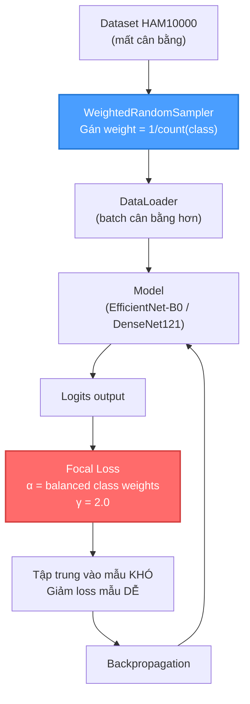
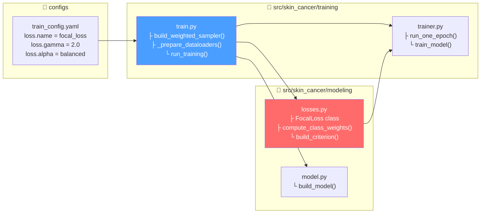

# Xử lý Mất Cân Bằng Dữ Liệu: Focal Loss & WeightedRandomSampler

## 1. Bối cảnh vấn đề

Bộ dữ liệu **HAM10000** có 7 loại tổn thương da, nhưng phân bố **rất lệch**:
- Lớp `nv` (Melanocytic nevi) chiếm **~67%** tổng dữ liệu (~6705 ảnh)
- Lớp `df` (Dermatofibroma) chỉ chiếm **~1.1%** (~115 ảnh)

→ Nếu không xử lý, model sẽ **thiên lệch dự đoán lớp đa số** (`nv`) và **bỏ qua các lớp thiểu số** (đặc biệt nguy hiểm với `mel` - melanoma ác tính).

Project sử dụng **2 kỹ thuật kết hợp** để giải quyết:

| Kỹ thuật | Tác động ở đâu | Vai trò |
|----------|----------------|---------|
| **WeightedRandomSampler** | **Data loading** (trước khi vào model) | Cân bằng tần suất xuất hiện của các lớp trong mỗi batch |
| **Focal Loss** | **Loss function** (trong quá trình tính loss) | Tập trung học vào các mẫu khó phân loại |

---

## 2. WeightedRandomSampler — Cân bằng ở tầng Data

### 2.1 Ý tưởng

> **Oversampling** lớp thiểu số bằng cách gán xác suất lấy mẫu cao hơn cho các mẫu thuộc lớp ít.

Thay vì lấy tuần tự (shuffle đều), sampler sẽ:
- Mẫu thuộc lớp `df` (115 ảnh) có xác suất chọn **cao hơn ~58 lần** so với lớp `nv` (6705 ảnh)
- Kết quả: mỗi epoch, model nhìn thấy **gần bằng nhau** số mẫu từ mỗi lớp

### 2.2 Cách tính trọng số

```
weight(sample_i) = 1 / count(class_of_sample_i)
```

Ví dụ:
- Mẫu thuộc `nv` (6705 ảnh): weight = 1/6705 ≈ 0.000149
- Mẫu thuộc `df` (115 ảnh): weight = 1/115 ≈ 0.008696

### 2.3 Vị trí trong code

#### Xây dựng Sampler: [train.py#L93-L96](file:///d:/Hoc/skin-cancer-classification-v3/src/skin_cancer/training/train.py#L93-L96)

```python
def build_weighted_sampler(train_df: pd.DataFrame) -> WeightedRandomSampler:
    class_counts = train_df["label"].value_counts().to_dict()
    weights = train_df["label"].map(lambda label: 1.0 / class_counts[int(label)]).to_numpy()
    return WeightedRandomSampler(weights=weights, num_samples=len(weights), replacement=True)
```

> [!NOTE]
> `replacement=True` cho phép lấy lại mẫu đã chọn → lớp thiểu số sẽ được lặp lại nhiều lần trong 1 epoch.

#### Sử dụng Sampler trong DataLoader: [train.py#L119-L127](file:///d:/Hoc/skin-cancer-classification-v3/src/skin_cancer/training/train.py#L119-L127)

```python
sampler = build_weighted_sampler(train_df) if use_weighted_sampler else None
train_loader = DataLoader(
    train_dataset,
    batch_size=int(cfg.training.batch_size),
    shuffle=sampler is None,    # ← Khi dùng sampler thì TẮT shuffle
    sampler=sampler,             # ← Gán sampler vào DataLoader
    num_workers=int(cfg.data.num_workers),
    pin_memory=bool(cfg.data.pin_memory),
)
```

> [!IMPORTANT]
> `shuffle` và `sampler` **không thể dùng đồng thời** trong PyTorch DataLoader. Khi có sampler → `shuffle=False` (tự động qua `sampler is None`).

#### Điều khiển bật/tắt: [train.py#L218-L219](file:///d:/Hoc/skin-cancer-classification-v3/src/skin_cancer/training/train.py#L218-L219)

```python
if use_weighted_sampler is None:
    use_weighted_sampler = bool(getattr(cfg.training, "use_weighted_sampler", True))
```

CLI flags: `--use-weighted-sampler` / `--no-weighted-sampler` tại [train.py#L290-L302](file:///d:/Hoc/skin-cancer-classification-v3/src/skin_cancer/training/train.py#L290-L302)

---

## 3. Focal Loss — Cân bằng ở tầng Loss Function

### 3.1 Ý tưởng

> Giảm trọng số loss cho các mẫu **dễ** (model đã phân loại đúng với confidence cao), tập trung vào các mẫu **khó** (model phân loại sai hoặc không chắc chắn).

Công thức:

```
FL(p_t) = -α_t × (1 - p_t)^γ × log(p_t)
```

Trong đó:
- `p_t`: xác suất model dự đoán đúng lớp thật
- `γ` (gamma): **focusing parameter** — γ càng lớn, mẫu dễ bị giảm weight càng mạnh
- `α_t`: **class weight** — trọng số từng lớp, tính theo tần suất nghịch đảo

### 3.2 Cách hoạt động

| Trường hợp | p_t | (1-p_t)^γ | Ảnh hưởng |
|------------|-----|-----------|-----------|
| Model **rất tự tin đúng** | 0.95 | (0.05)² = 0.0025 | Loss **giảm ~400 lần** → gần như bỏ qua |
| Model **không chắc chắn** | 0.5 | (0.5)² = 0.25 | Loss giảm 4 lần → vẫn học |
| Model **dự đoán sai** | 0.1 | (0.9)² = 0.81 | Loss **gần như giữ nguyên** → học mạnh |

→ Model tập trung vào **mẫu khó** (thường là mẫu lớp thiểu số hoặc mẫu ở ranh giới giữa các lớp).

### 3.3 Class Weight (alpha)

Ngoài focusing, Focal Loss trong project còn kết hợp **class weight** (`alpha`):

```
α_c = N / (C × count_c)
```

- `N`: tổng số mẫu
- `C`: số lớp (7)
- `count_c`: số mẫu của lớp c

Ví dụ: lớp `df` (115 mẫu) sẽ có weight **cao hơn ~58 lần** so với lớp `nv` (6705 mẫu).

### 3.4 Vị trí trong code

#### Class FocalLoss: [losses.py#L8-L37](file:///d:/Hoc/skin-cancer-classification-v3/src/skin_cancer/modeling/losses.py#L8-L37)

```python
class FocalLoss(nn.Module):
    def __init__(self, alpha=None, gamma=2.0, reduction="mean"):
        super().__init__()
        self.alpha = alpha      # class weights tensor
        self.gamma = gamma      # focusing parameter

    def forward(self, logits, targets):
        # Bước 1: Tính Cross-Entropy loss chuẩn (có class weight)
        ce_loss = F.cross_entropy(logits, targets, weight=self.alpha, reduction="none")

        # Bước 2: Tính xác suất đúng p_t
        pt = torch.exp(-ce_loss)

        # Bước 3: Áp dụng modulating factor (1-pt)^γ
        focal_loss = ((1 - pt) ** self.gamma) * ce_loss

        return focal_loss.mean()
```

#### Tính class weights: [losses.py#L40-L47](file:///d:/Hoc/skin-cancer-classification-v3/src/skin_cancer/modeling/losses.py#L40-L47)

```python
def compute_class_weights(labels, num_classes):
    """Balanced class weights: N / (C * count_c)."""
    counts = torch.bincount(labels_tensor, minlength=num_classes).float()
    counts = torch.clamp(counts, min=1.0)   # tránh chia cho 0
    total = counts.sum()
    weights = total / (num_classes * counts)
    return weights
```

#### Khởi tạo criterion: [losses.py#L50-L66](file:///d:/Hoc/skin-cancer-classification-v3/src/skin_cancer/modeling/losses.py#L50-L66)

```python
def build_criterion(loss_name, num_classes, train_labels, device, alpha="balanced", gamma=2.0):
    class_weights = None
    if alpha == "balanced":
        class_weights = compute_class_weights(train_labels, num_classes).to(device)

    if loss_name == "focal_loss":
        return FocalLoss(alpha=class_weights, gamma=gamma)
```

#### Sử dụng trong training pipeline: [train.py#L237-L244](file:///d:/Hoc/skin-cancer-classification-v3/src/skin_cancer/training/train.py#L237-L244)

```python
criterion = build_criterion(
    loss_name=cfg.loss.name,          # "focal_loss"
    num_classes=int(cfg.model.num_classes),  # 7
    train_labels=train_df["label"].tolist(),
    device=device,
    alpha=cfg.loss.alpha,             # "balanced"
    gamma=float(cfg.loss.gamma),      # 2.0
)
```

#### Cấu hình trong config: [train_config.yaml#L47-L50](file:///d:/Hoc/skin-cancer-classification-v3/configs/train_config.yaml#L47-L50)

```yaml
loss:
  name: "focal_loss"
  gamma: 2.0
  alpha: "balanced"
```

---

## 4. Tổng quan luồng hoạt động



## 5. Sơ đồ vị trí trong codebase



## 6. So sánh 2 kỹ thuật

| Tiêu chí | WeightedRandomSampler | Focal Loss |
|----------|----------------------|------------|
| **Tác động** | Tầng **Data** (trước model) | Tầng **Loss** (sau model) |
| **Cơ chế** | Thay đổi **tần suất lấy mẫu** | Thay đổi **trọng số loss** |
| **Mục tiêu** | Mỗi batch có **đủ mẫu** từ tất cả lớp | Tập trung học vào **mẫu khó** |
| **Nhược điểm** | Overfitting lớp thiểu số (lặp mẫu) | Không giải quyết việc model ít thấy lớp thiểu số |
| **File chính** | [train.py](file:///d:/Hoc/skin-cancer-classification-v3/src/skin_cancer/training/train.py) | [losses.py](file:///d:/Hoc/skin-cancer-classification-v3/src/skin_cancer/modeling/losses.py) |

> [!TIP]
> **Kết hợp cả 2** là cách tiếp cận mạnh mẽ nhất:
> - **WeightedRandomSampler** đảm bảo model **nhìn thấy đủ mẫu** từ mọi lớp
> - **Focal Loss** đảm bảo model **tập trung học** vào các mẫu khó phân loại
> - Tránh nhược điểm khi chỉ dùng 1 trong 2

## 7. Tóm tắt vị trí code xử lý mất cân bằng

| Vị trí | File | Dòng | Chức năng |
|--------|------|------|-----------|
| `build_weighted_sampler()` | [train.py](file:///d:/Hoc/skin-cancer-classification-v3/src/skin_cancer/training/train.py#L93-L96) | 93-96 | Tạo sampler với weight nghịch đảo |
| `_prepare_dataloaders()` | [train.py](file:///d:/Hoc/skin-cancer-classification-v3/src/skin_cancer/training/train.py#L99-L135) | 119-127 | Gắn sampler vào DataLoader |
| `FocalLoss` class | [losses.py](file:///d:/Hoc/skin-cancer-classification-v3/src/skin_cancer/modeling/losses.py#L8-L37) | 8-37 | Focal Loss implementation |
| `compute_class_weights()` | [losses.py](file:///d:/Hoc/skin-cancer-classification-v3/src/skin_cancer/modeling/losses.py#L40-L47) | 40-47 | Tính balanced class weights |
| `build_criterion()` | [losses.py](file:///d:/Hoc/skin-cancer-classification-v3/src/skin_cancer/modeling/losses.py#L50-L66) | 50-66 | Factory tạo loss function |
| `run_training()` | [train.py](file:///d:/Hoc/skin-cancer-classification-v3/src/skin_cancer/training/train.py#L237-L244) | 237-244 | Gọi build_criterion() với config |
| Config | [train_config.yaml](file:///d:/Hoc/skin-cancer-classification-v3/configs/train_config.yaml#L47-L50) | 47-50 | Cấu hình loss function |
