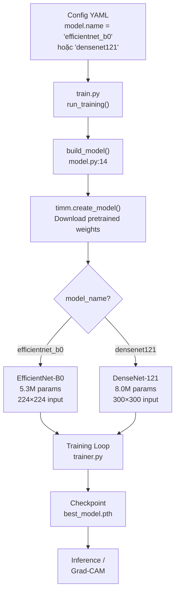

# EfficientNet-B0 vs DenseNet121

> Tài liệu giải thích hai mô hình deep learning được sử dụng trong dự án **HAM10000 Skin Cancer Classification**.

---

## 1. EfficientNet-B0

### 1.1 Ý tưởng cốt lõi

EfficientNet được giới thiệu bởi **Tan & Le (Google, 2019)** trong bài báo *"EfficientNet: Rethinking Model Scaling for Convolutional Neural Networks"*.

**Vấn đề cần giải quyết:** Trước đây, khi muốn tăng hiệu suất của CNN, người ta thường scale up theo **một chiều duy nhất**:
- Tăng **depth** (nhiều layer hơn) → ResNet-18 → ResNet-152
- Tăng **width** (nhiều channel/filter hơn)
- Tăng **resolution** (ảnh đầu vào lớn hơn)

Nhưng việc tăng chỉ một chiều sẽ nhanh chóng bão hòa (diminishing returns).

**Giải pháp — Compound Scaling:** EfficientNet đề xuất **scale đồng thời cả 3 chiều** (depth, width, resolution) theo một tỷ lệ cố định, được điều khiển bởi một hệ số φ (phi):

```
depth:      d = α^φ
width:      w = β^φ  
resolution: r = γ^φ

với ràng buộc: α · β² · γ² ≈ 2
```

- **α, β, γ** được tìm qua grid search trên baseline model (B0)
- **φ** là hệ số do người dùng chọn → tạo ra B0, B1, ..., B7

### 1.2 Kiến trúc chi tiết

EfficientNet-B0 (baseline) được thiết kế bằng **Neural Architecture Search (NAS)**, cụ thể là phương pháp **MnasNet**. Kiến trúc gồm:

```
Input (224×224×3)
    │
    ▼
┌─────────────────────────────┐
│  Conv3×3, stride 2          │  ← Stem: giảm resolution ban đầu
│  BatchNorm + Swish          │
└─────────────────────────────┘
    │
    ▼
┌─────────────────────────────┐
│  MBConv Blocks (7 stages)   │  ← Thân mạng chính
│                             │
│  Stage 1: MBConv1, k3×3     │  (16 channels, 1 block)
│  Stage 2: MBConv6, k3×3     │  (24 channels, 2 blocks)
│  Stage 3: MBConv6, k5×5     │  (40 channels, 2 blocks)
│  Stage 4: MBConv6, k3×3     │  (80 channels, 3 blocks)
│  Stage 5: MBConv6, k5×5     │  (112 channels, 3 blocks)
│  Stage 6: MBConv6, k5×5     │  (192 channels, 4 blocks)
│  Stage 7: MBConv6, k3×3     │  (320 channels, 1 block)
└─────────────────────────────┘
    │
    ▼
┌─────────────────────────────┐
│  Conv1×1 → 1280 channels    │  ← Head
│  Global Average Pooling     │
│  Fully Connected → 7 class  │  ← Thay đổi cho bài toán HAM10000
└─────────────────────────────┘
```

### 1.3 MBConv Block — thành phần cốt lõi

**MBConv** (Mobile Inverted Bottleneck Convolution) là building block chính, kế thừa từ MobileNetV2:

```
Input
  │
  ├──────────────────────────────────┐ (skip connection nếu input = output size)
  │                                  │
  ▼                                  │
┌──────────────────┐                 │
│ Expand: Conv1×1  │  Tăng channels  │
│ (expand_ratio=6) │  lên 6 lần      │
│ BN + Swish       │                 │
└──────────────────┘                 │
  │                                  │
  ▼                                  │
┌──────────────────┐                 │
│ Depthwise Conv   │  Lọc spatial    │
│ (k3×3 hoặc k5×5) │  riêng từng ch  │
│ BN + Swish       │                 │
└──────────────────┘                 │
  │                                  │
  ▼                                  │
┌──────────────────┐                 │
│ Squeeze-Excite   │  Channel        │
│ (SE attention)   │  attention      │
└──────────────────┘                 │
  │                                  │
  ▼                                  │
┌──────────────────┐                 │
│ Project: Conv1×1 │  Giảm channels  │
│ BN (no activate) │  về output dim  │
└──────────────────┘                 │
  │                                  │
  ▼                                  │
  + ◄────────────────────────────────┘
  │ (Element-wise addition)
  ▼
Output
```

**Các thành phần quan trọng:**

| Thành phần | Vai trò |
|---|---|
| **Depthwise Separable Conv** | Giảm tính toán: thay vì standard conv `k×k×C_in×C_out`, tách thành depthwise (`k×k×1` mỗi channel) + pointwise (`1×1×C_in×C_out`) |
| **Squeeze-and-Excitation (SE)** | Channel attention: Global Pool → FC → ReLU → FC → Sigmoid → nhân lại vào feature map, giúp model tự học tầm quan trọng của mỗi channel |
| **Swish activation** | `f(x) = x · sigmoid(x)`, smooth hơn ReLU, giúp gradient flow tốt hơn |
| **Inverted Residual** | Mở rộng rồi thu hẹp (ngược với ResNet bottleneck), giữ skip connection ở chiều nhỏ |

### 1.4 Thông số EfficientNet-B0

| Thông số | Giá trị |
|---|---|
| Input Resolution | 224 × 224 |
| Parameters | **~5.3M** |
| FLOPs | ~0.39B |
| Top-1 Accuracy (ImageNet) | 77.1% |
| Activation function | Swish |

---

## 2. DenseNet-121

### 2.1 Ý tưởng cốt lõi

DenseNet được giới thiệu bởi **Huang et al. (2017)** trong bài báo *"Densely Connected Convolutional Networks"* (CVPR 2017, Best Paper).

**Vấn đề:** Trong các mạng truyền thống (VGG, ResNet), thông tin từ các layer trước có thể bị "mờ dần" khi truyền qua nhiều layer.

- **ResNet** giải quyết bằng skip connection: `output = F(x) + x` (cộng)
- **DenseNet** đi xa hơn: **mỗi layer nhận feature maps từ TẤT CẢ các layer trước đó** (nối - concatenation)

```
Giả sử có 4 layer (L0, L1, L2, L3):

ResNet:     L0 → L1 → L2 → L3     (mỗi layer + input trước đó)
DenseNet:   L0 → L1 → L2 → L3     (mỗi layer nhận ALL layer trước)

Layer 0:  x₀
Layer 1:  x₁ = H₁(x₀)
Layer 2:  x₂ = H₂([x₀, x₁])           ← concat x₀ và x₁
Layer 3:  x₃ = H₃([x₀, x₁, x₂])      ← concat tất cả
```

**Lợi ích:**
- **Feature reuse tối đa** — không layer nào bị "quên"
- **Gradient flow mạnh** — mỗi layer có direct access tới loss gradient
- **Compact model** — mỗi layer chỉ cần tạo ít feature maps mới (growth rate `k`)
- **Ít tham số hơn** so với ResNet cùng độ sâu

### 2.2 Kiến trúc chi tiết

```
Input (224×224×3)   ← Trong project dùng 300×300 cho DenseNet
    │
    ▼
┌──────────────────────────────┐
│  Conv 7×7, stride 2          │  ← Initial convolution
│  BatchNorm + ReLU            │
│  MaxPool 3×3, stride 2       │
└──────────────────────────────┘
    │
    ▼
┌──────────────────────────────┐
│  Dense Block 1 (6 layers)    │
│  ↓                           │
│  Transition Layer 1          │  ← 1×1 Conv + 2×2 AvgPool (giảm 50%)
│  ↓                           │
│  Dense Block 2 (12 layers)   │
│  ↓                           │
│  Transition Layer 2          │
│  ↓                           │
│  Dense Block 3 (24 layers)   │
│  ↓                           │
│  Transition Layer 3          │
│  ↓                           │
│  Dense Block 4 (16 layers)   │
└──────────────────────────────┘
    │
    ▼
┌──────────────────────────────┐
│  Global Average Pooling      │
│  Fully Connected → 7 class   │  ← Thay đổi cho bài toán HAM10000
└──────────────────────────────┘
```

> **121** trong DenseNet-121 = 1 (conv đầu) + (6+12+24+16) layers trong Dense Blocks + 3 Transition layers + 1 FC = **121 layers có tham số**.

### 2.3 Dense Block — thành phần cốt lõi

Mỗi layer bên trong Dense Block gồm cấu trúc **BN-ReLU-Conv** (Bottleneck):

```
Input: [x₀, x₁, ..., xₗ₋₁]   (concat tất cả feature maps trước đó)
    │
    ▼
┌───────────────────────┐
│  BatchNorm → ReLU     │
│  Conv 1×1 → 4k ch     │  ← Bottleneck: giảm channels trước
└───────────────────────┘
    │
    ▼
┌───────────────────────┐
│  BatchNorm → ReLU     │
│  Conv 3×3 → k ch      │  ← Tạo k feature maps mới (growth rate)
└───────────────────────┘
    │
    ▼
Output: xₗ  (k channels)

→ Được CONCAT vào: [x₀, x₁, ..., xₗ₋₁, xₗ]
```

### 2.4 Transition Layer — giảm kích thước

Vì Dense Block liên tục concat → số channels tăng dần, cần **Transition Layer** để giảm:

```
Input: feature map (H × W × C)
    │
    ▼
┌───────────────────────┐
│  BatchNorm            │
│  Conv 1×1 → C/2 ch    │  ← Giảm channels 50% (compression θ=0.5)
│  AvgPool 2×2, stride 2│  ← Giảm spatial 50%
└───────────────────────┘
    │
    ▼
Output: (H/2 × W/2 × C/2)
```

### 2.5 Growth Rate (k) — tham số đặc trưng

| Khái niệm | Giải thích |
|---|---|
| **Growth rate k** | Mỗi layer tạo thêm `k` feature maps mới |
| **DenseNet-121** | k = 32 |
| **Tổng channels** | Tăng tuyến tính: sau `l` layers = `k₀ + l × k` |
| **Ý nghĩa** | k nhỏ (32) vẫn hiệu quả nhờ feature reuse → model nhỏ gọn |

### 2.6 Thông số DenseNet-121

| Thông số | Giá trị |
|---|---|
| Input Resolution | 224 × 224 (gốc), **300 × 300** (trong project) |
| Parameters | **~8.0M** |
| FLOPs | ~2.87B |
| Top-1 Accuracy (ImageNet) | 74.4% |
| Growth rate | 32 |
| Dense Block config | [6, 12, 24, 16] |

---

## 3. So sánh hai mô hình

| Tiêu chí | EfficientNet-B0 | DenseNet-121 |
|---|---|---|
| **Năm ra đời** | 2019 | 2017 |
| **Ý tưởng chính** | Compound Scaling + NAS | Dense Connection (concat all) |
| **Building block** | MBConv (Inverted Residual + SE) | BN-ReLU-Conv Bottleneck |
| **Connection type** | Skip connection (add) | Dense connection (concat) |
| **Parameters** | ~5.3M ✅ ít hơn | ~8.0M |
| **FLOPs** | ~0.39B ✅ ít hơn | ~2.87B |
| **ImageNet Top-1** | 77.1% ✅ cao hơn | 74.4% |
| **Ưu điểm** | Nhẹ, nhanh, hiệu quả | Feature reuse tốt, gradient mạnh |
| **Nhược điểm** | Phụ thuộc NAS design | Memory cao do concat, nhiều FLOPs |
| **Image size (project)** | 224 | 300 |

> **Nhận xét:** EfficientNet-B0 hiệu quả hơn về cả tham số và accuracy trên ImageNet. DenseNet-121 có lợi thế về gradient flow và feature reuse, có thể hoạt động tốt hơn trên dataset nhỏ hoặc khi cần feature đa dạng.

---

## 4. Vị trí trong Code

### 4.1 Model Builder — Nơi tạo model

📄 [model.py](file:///d:/Hoc/skin-cancer-classification-v3/src/skin_cancer/modeling/model.py)

```python
# Line 14-21: Hàm build_model sử dụng thư viện timm để tạo model
def build_model(model_name: str, num_classes: int, pretrained: bool = True) -> nn.Module:
    """Build EfficientNet/DenseNet/etc. through timm."""
    model = timm.create_model(model_name, pretrained=pretrained, num_classes=num_classes)
    return model
```

> **Cách hoạt động:** Hàm `timm.create_model()` nhận `model_name` (ví dụ: `"efficientnet_b0"` hoặc `"densenet121"`) và tự động:
> 1. Tải kiến trúc tương ứng
> 2. Download pretrained weights từ ImageNet (nếu `pretrained=True`)
> 3. Thay thế lớp classifier cuối bằng FC layer mới với `num_classes=7` (7 loại bệnh da)

---

### 4.2 Gọi build_model trong Training Pipeline

📄 [train.py](file:///d:/Hoc/skin-cancer-classification-v3/src/skin_cancer/training/train.py)

```python
# Line 231-235: Tạo model và đưa lên GPU/CPU
model = build_model(
    model_name=cfg.model.name,        # "efficientnet_b0" hoặc "densenet121"
    num_classes=int(cfg.model.num_classes),  # 7
    pretrained=bool(cfg.model.pretrained),   # True (transfer learning)
).to(device)
```

---

### 4.3 Config files — Nơi chọn model

#### EfficientNet-B0 configs:

📁 `configs/eff_B0/`

| Config file | Batch Size | Gamma | Learning Rate |
|---|---|---|---|
| [b0_bs32_gamma2.yaml](file:///d:/Hoc/skin-cancer-classification-v3/configs/eff_B0/b0_bs32_gamma2.yaml) | 32 | 1.0 | 5e-5 |
| [b0_bs16_gamma2.yaml](file:///d:/Hoc/skin-cancer-classification-v3/configs/eff_B0/b0_bs16_gamma2.yaml) | 16 | 2.0 | — |
| [b0_bs16_gamma1.yaml](file:///d:/Hoc/skin-cancer-classification-v3/configs/eff_B0/b0_bs16_gamma1.yaml) | 16 | 1.0 | 5e-5 |

```yaml
# Trong mỗi config:
model:
  name: "efficientnet_b0"    # ← Tên model truyền vào timm
  pretrained: true
  num_classes: 7

data:
  image_size: 224             # ← Resolution chuẩn cho B0
```

#### DenseNet-121 configs:

📁 `configs/densenet121/`

| Config file | Batch Size | Gamma | Learning Rate |
|---|---|---|---|
| [densenet121_bs8_gamma2.yaml](file:///d:/Hoc/skin-cancer-classification-v3/configs/densenet121/densenet121_bs8_gamma2.yaml) | 16 | 2.0 | 1e-4 |
| [densenet121_bs4_gamma2.yaml](file:///d:/Hoc/skin-cancer-classification-v3/configs/densenet121/densenet121_bs4_gamma2.yaml) | 4 | 2.0 | — |

```yaml
# Trong mỗi config:
model:
  name: "densenet121"         # ← Tên model truyền vào timm
  pretrained: true
  num_classes: 7

data:
  image_size: 300             # ← Resolution lớn hơn cho DenseNet
```

> [!IMPORTANT]
> DenseNet-121 dùng `image_size: 300` (lớn hơn B0 là `224`), nên cần **batch_size nhỏ hơn** (8 hoặc 4) để fit vào VRAM GPU.

---

### 4.4 Default config

📄 [train_config.yaml](file:///d:/Hoc/skin-cancer-classification-v3/configs/train_config.yaml)

Model mặc định là `efficientnet_b0`:
```yaml
model:
  name: "efficientnet_b0"
  pretrained: true
  num_classes: 7
```

---

### 4.5 Inference & Explainability — Load model từ checkpoint

📄 [model.py](file:///d:/Hoc/skin-cancer-classification-v3/src/skin_cancer/modeling/model.py)

```python
# Line 37-47: Load model đã train từ file checkpoint
def load_model_from_checkpoint(checkpoint, model_name, num_classes, device):
    model = build_model(model_name=model_name, num_classes=num_classes, pretrained=False)
    model.load_state_dict(checkpoint["model_state_dict"])
    model.to(device)
    model.eval()
    return model
```

📄 [model.py](file:///d:/Hoc/skin-cancer-classification-v3/src/skin_cancer/modeling/model.py)

```python
# Line 24-34: Tìm last Conv2d layer cho Grad-CAM visualization
def get_last_conv_layer(model):
    """Find the last Conv2d layer, useful for Grad-CAM."""
    last_name = ""
    last_module = None
    for name, module in model.named_modules():
        if isinstance(module, nn.Conv2d):
            last_name = name
            last_module = module
    return last_name, last_module
```

> **Lưu ý:** Hàm `get_last_conv_layer` hoạt động cho cả EfficientNet-B0 và DenseNet-121 vì cả hai đều có `Conv2d` layers. Last conv layer sẽ khác nhau giữa hai model, nhưng hàm tự động tìm đúng layer.

---

### 4.6 Tóm tắt luồng code



---

## 5. Tại sao chọn hai model này?

| Lý do | Giải thích |
|---|---|
| **Transfer Learning** | Cả hai đều có pretrained weights từ ImageNet (14M ảnh), giúp học tốt trên dataset nhỏ như HAM10000 (~10K ảnh) |
| **Kích thước phù hợp** | Không quá lớn (B0: 5.3M, Dense121: 8M) → train được trên GPU thông thường |
| **So sánh kiến trúc** | Hai cách tiếp cận khác nhau (compound scaling vs dense connection) → so sánh để tìm model tốt nhất |
| **Proven in Medical Imaging** | Cả hai đã được chứng minh hiệu quả trong phân loại ảnh y tế |
