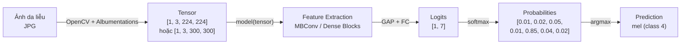
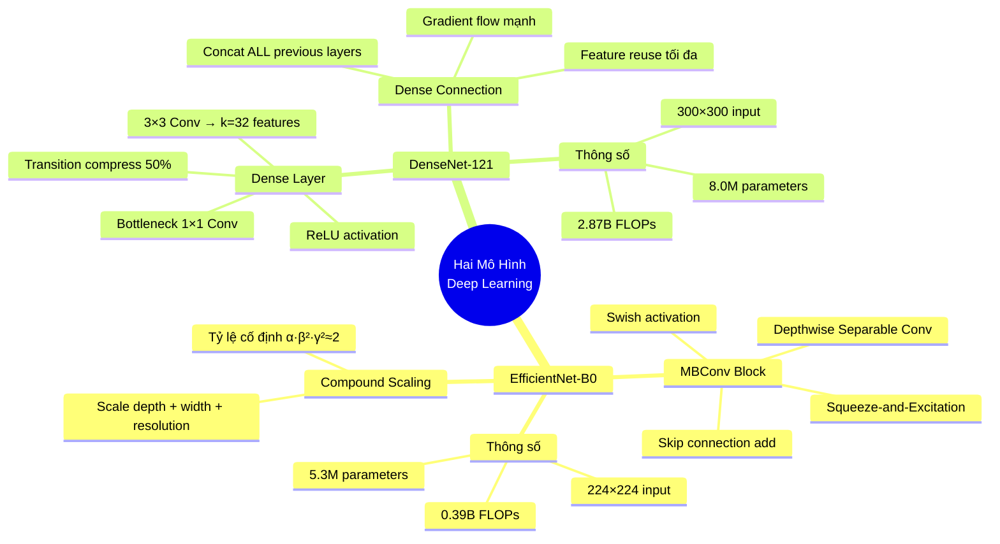

# Mô Tả Kiến Trúc Các Mô Hình Học Sâu

## EfficientNet-B0 & DenseNet-121 trong Phân Loại Tổn Thương Da HAM10000

---

## 1. Giới thiệu hai mô hình đã chọn

### 1.1 Tại sao chọn hai mô hình này?

| Tiêu chí | Giải thích |
|---|---|
| **Transfer Learning** | Cả hai đều có pretrained weights từ ImageNet (14 triệu ảnh), giúp học hiệu quả trên dataset nhỏ (~10K ảnh HAM10000) |
| **Kích thước phù hợp** | Đủ mạnh để phân loại 7 lớp, nhưng không quá nặng cho GPU thông thường |
| **Hai triết lý khác nhau** | So sánh Compound Scaling (EfficientNet) vs Dense Connection (DenseNet) để chọn model phù hợp nhất |
| **Đã được chứng minh** | Cả hai đạt kết quả cao trong nhiều nghiên cứu phân loại ảnh y tế |

### 1.2 Tổng quan nhanh

| | EfficientNet-B0 | DenseNet-121 |
|---|---|---|
| **Bài báo** | *Rethinking Model Scaling for CNNs* (2019) | *Densely Connected Convolutional Networks* (2017) |
| **Tác giả** | Tan & Le (Google) | Huang et al. (CVPR Best Paper) |
| **Ý tưởng chính** | Scale đồng thời depth + width + resolution | Mỗi layer kết nối với TẤT CẢ layer trước |
| **Parameters** | ~5.3 triệu | ~8.0 triệu |
| **ImageNet Top-1** | 77.1% | 74.4% |

---

## 2. EfficientNet-B0 — Kiến trúc chi tiết

### 2.1 Ý tưởng cốt lõi: Compound Scaling

Trước EfficientNet, việc tăng hiệu suất CNN thường đi theo **một chiều duy nhất**:

```
Tăng Depth     → ResNet-18 → ResNet-152      (nhiều layer hơn)
Tăng Width     → WideResNet                   (nhiều channel hơn)  
Tăng Resolution → Ảnh 224 → 300 → 600        (ảnh đầu vào lớn hơn)
```

> [!IMPORTANT]
> **Vấn đề**: Tăng chỉ một chiều sẽ nhanh chóng **bão hòa** (diminishing returns). Ví dụ: ResNet-152 không tốt hơn ResNet-101 đáng kể.

**Giải pháp của EfficientNet — Compound Scaling**: Scale **đồng thời cả 3 chiều** theo tỷ lệ cố định:

```
depth (số layer):       d = α^φ
width (số channel):     w = β^φ
resolution (kích thước): r = γ^φ

Ràng buộc:  α · β² · γ² ≈ 2
            (giữ tổng FLOPs tăng ~2^φ)
```

- **α = 1.2, β = 1.1, γ = 1.15** — tìm bằng grid search trên B0
- **φ** — hệ số người dùng chọn → tạo ra các phiên bản B0 → B7

```
B0: φ = 1.0  → 5.3M params   (baseline — dùng trong project)
B1: φ = 1.0  → 7.8M params
B3: φ = 1.0  → 12M params
B7: φ = 2.0  → 66M params
```

### 2.2 Nguồn gốc: Neural Architecture Search (NAS)

Kiến trúc B0 (baseline) **không được thiết kế thủ công**, mà được tìm tự động bằng **MnasNet** — một thuật toán NAS tối ưu đồng thời accuracy và latency.

### 2.3 Kiến trúc tổng quan

```
┌─────────────────────────────────────────────────┐
│              EfficientNet-B0                     │
│                                                  │
│  Input: 224 × 224 × 3 (RGB)                     │
│                                                  │
│  ┌─────────────────────────────────────────┐     │
│  │  STEM                                   │     │
│  │  Conv 3×3, stride=2 → 32 channels      │     │
│  │  BatchNorm + Swish                      │     │
│  │  Output: 112 × 112 × 32                │     │
│  └─────────────────────────────────────────┘     │
│                    ↓                              │
│  ┌─────────────────────────────────────────┐     │
│  │  BODY: 7 Stages, tổng 16 MBConv Blocks │     │
│  │  (chi tiết bảng bên dưới)               │     │
│  └─────────────────────────────────────────┘     │
│                    ↓                              │
│  ┌─────────────────────────────────────────┐     │
│  │  HEAD                                   │     │
│  │  Conv 1×1 → 1280 channels              │     │
│  │  Global Average Pooling                 │     │
│  │  Dropout(0.2)                           │     │
│  │  Fully Connected → 7 classes            │     │
│  │  (thay đổi cho HAM10000)                │     │
│  └─────────────────────────────────────────┘     │
│                                                  │
│  Output: vector 7 chiều (logits)                 │
└─────────────────────────────────────────────────┘
```

### 2.4 Chi tiết 7 Stages — Bảng thông số

| Stage | Operator | Resolution | Channels | Số blocks | Kernel | Stride | Expand Ratio |
|---|---|---|---|---|---|---|---|
| 1 | MBConv1 | 112×112 | 16 | 1 | 3×3 | 1 | 1 |
| 2 | MBConv6 | 112×112 → 56×56 | 24 | 2 | 3×3 | 2 | 6 |
| 3 | MBConv6 | 56×56 → 28×28 | 40 | 2 | 5×5 | 2 | 6 |
| 4 | MBConv6 | 28×28 → 14×14 | 80 | 3 | 3×3 | 2 | 6 |
| 5 | MBConv6 | 14×14 | 112 | 3 | 5×5 | 1 | 6 |
| 6 | MBConv6 | 14×14 → 7×7 | 192 | 4 | 5×5 | 2 | 6 |
| 7 | MBConv6 | 7×7 | 320 | 1 | 3×3 | 1 | 6 |

> **Tổng: 16 MBConv blocks** (1+2+2+3+3+4+1)

### 2.5 MBConv Block — Building Block chính

**MBConv** (Mobile Inverted Bottleneck Convolution) kế thừa từ MobileNetV2, gồm 4 thành phần:

```
Input (H × W × C_in)
  │
  ├─────────────────────────────────────┐
  │                                     │ Skip Connection
  ▼                                     │ (chỉ khi C_in = C_out
┌──────────────────────────┐            │  và stride = 1)
│ ① EXPAND                │            │
│ Conv 1×1: C_in → C_in×t │            │
│ BatchNorm + Swish        │            │
│ (t = expand_ratio = 6)  │            │
└──────────────────────────┘            │
  │                                     │
  ▼                                     │
┌──────────────────────────┐            │
│ ② DEPTHWISE CONV         │            │
│ DWConv k×k: mỗi channel │            │
│ một filter riêng         │            │
│ BatchNorm + Swish        │            │
└──────────────────────────┘            │
  │                                     │
  ▼                                     │
┌──────────────────────────┐            │
│ ③ SQUEEZE-AND-EXCITATION │            │
│ GlobalAvgPool → FC → ReLU│            │
│ → FC → Sigmoid           │            │
│ Nhân lại vào feature map │            │
└──────────────────────────┘            │
  │                                     │
  ▼                                     │
┌──────────────────────────┐            │
│ ④ PROJECT                │            │
│ Conv 1×1: C_in×t → C_out │            │
│ BatchNorm (KHÔNG activ.) │            │
└──────────────────────────┘            │
  │                                     │
  ▼                                     │
  + ◄───────────────────────────────────┘
  │  (Element-wise addition)
  ▼
Output (H' × W' × C_out)
```

#### Giải thích từng thành phần:

**① Expand (Conv 1×1):**
- Mở rộng số channels lên `t` lần (t=6 cho MBConv6)
- Ví dụ: 24 channels → 144 channels
- Mục đích: tạo không gian biểu diễn giàu hơn cho depthwise conv

**② Depthwise Convolution:**
- Mỗi channel có **một filter riêng** (không trộn giữa các channels)
- Giảm tính toán: từ `k²·C_in·C_out` xuống `k²·C_in`
- Kernel 3×3 hoặc 5×5 tùy stage

```
Standard Conv:   k × k × C_in × C_out  FLOPs
Depthwise Conv:  k × k × C_in          FLOPs  ← rẻ hơn C_out lần
```

**③ Squeeze-and-Excitation (SE):**
- **Channel attention mechanism** — model tự học channel nào quan trọng
- Luồng: GlobalAvgPool → FC (giảm) → ReLU → FC (tăng) → Sigmoid → nhân lại

```
Feature map [H, W, C]
    ↓ Global Average Pool
Vector [1, 1, C]
    ↓ FC: C → C/4 → ReLU
    ↓ FC: C/4 → C → Sigmoid
Scale [1, 1, C]           ← giá trị 0-1 cho mỗi channel
    ↓ × Feature map
Output [H, W, C]          ← channels quan trọng được "tăng sáng"
```

**④ Project (Conv 1×1):**
- Thu hẹp channels về kích thước output
- **Không có activation** — bảo toàn thông tin cho skip connection

**Swish Activation:**
```
Swish(x) = x · σ(x) = x · sigmoid(x)

So với ReLU:
- ReLU: max(0, x)        → cắt hoàn toàn giá trị âm
- Swish: x · sigmoid(x)  → smooth, giữ một phần giá trị âm
                          → gradient flow tốt hơn
```

### 2.6 Tổng kết thông số EfficientNet-B0

| Thông số | Giá trị |
|---|---|
| **Input size** | **224 × 224 × 3** |
| **Output** | Vector 7 chiều (logits) |
| **Tổng parameters** | **~5.3 triệu** |
| **FLOPs** | ~0.39 tỷ |
| **Số MBConv blocks** | 16 (qua 7 stages) |
| **Backbone output channels** | 1280 |
| **Activation** | Swish |
| **Attention** | Squeeze-and-Excitation |
| **Skip connection** | Addition (khi size khớp) |
| **ImageNet Top-1** | 77.1% |

---

## 3. DenseNet-121 — Kiến trúc chi tiết

### 3.1 Ý tưởng cốt lõi: Dense Connection

#### So sánh với các mạng trước đó

```
VGG (2014):     L0 → L1 → L2 → L3 → L4
                Mỗi layer chỉ nhận input từ layer ngay trước.
                → Thông tin có thể bị mờ dần qua nhiều layer.

ResNet (2015):  L0 ──→ L1 ──→ L2 ──→ L3
                 └──+───┘ └──+───┘
                Skip connection: output = F(x) + x (CỘNG)
                → Gradient flow tốt hơn, nhưng chỉ kết nối 2 layer.

DenseNet (2017): L0 ──→ L1 ──→ L2 ──→ L3
                  │      │      │
                  └──────┤      │
                  └──────┴──────┘
                Dense connection: output = H([x₀, x₁, ..., xₗ]) (NỐI TẤT CẢ)
                → Feature reuse tối đa.
```

> [!IMPORTANT]
> **Khác biệt quan trọng**:
> - **ResNet**: skip connection bằng **phép cộng** (addition) → trộn features
> - **DenseNet**: dense connection bằng **phép nối** (concatenation) → giữ nguyên features

#### Ví dụ minh họa Dense Connection

```
Giả sử Dense Block có 4 layers, growth rate k = 32:

Layer 0:  Input x₀                               [H, W, 64]
Layer 1:  x₁ = H₁(x₀)                            [H, W, 32]  ← tạo 32 feature maps mới
Layer 2:  x₂ = H₂([x₀, x₁])                      [H, W, 32]  ← nhận 64+32 = 96 channels
Layer 3:  x₃ = H₃([x₀, x₁, x₂])                  [H, W, 32]  ← nhận 64+32+32 = 128 channels
Layer 4:  x₄ = H₄([x₀, x₁, x₂, x₃])              [H, W, 32]  ← nhận 64+32+32+32 = 160 channels

Output:   [x₀, x₁, x₂, x₃, x₄]                  [H, W, 64+4×32 = 192]
```

**Lợi ích:**
- **Feature reuse tối đa**: mọi layer đều có thể truy cập trực tiếp features từ tất cả layer trước
- **Gradient flow mạnh**: mỗi layer có đường truyền gradient trực tiếp tới loss
- **Compact**: mỗi layer chỉ cần tạo ít features mới (k=32), phần còn lại reuse
- **Regularization tự nhiên**: ít bị overfitting hơn do parameter-efficient

### 3.2 Kiến trúc tổng quan

```
┌──────────────────────────────────────────────────┐
│              DenseNet-121                          │
│                                                   │
│  Input: 224 × 224 × 3 (gốc)                      │
│         300 × 300 × 3 (trong project)             │
│                                                   │
│  ┌──────────────────────────────────────────┐     │
│  │  INITIAL CONVOLUTION                     │     │
│  │  Conv 7×7, stride=2 → 64 channels       │     │
│  │  BatchNorm + ReLU                        │     │
│  │  MaxPool 3×3, stride=2                   │     │
│  │  Output: 56 × 56 × 64                   │     │
│  └──────────────────────────────────────────┘     │
│                    ↓                               │
│  ┌──────────────────────────────────────────┐     │
│  │  Dense Block 1    (6 layers)             │     │
│  │  Transition 1     (compress 50%)         │     │
│  │  Dense Block 2    (12 layers)            │     │
│  │  Transition 2     (compress 50%)         │     │
│  │  Dense Block 3    (24 layers)            │     │
│  │  Transition 3     (compress 50%)         │     │
│  │  Dense Block 4    (16 layers)            │     │
│  └──────────────────────────────────────────┘     │
│                    ↓                               │
│  ┌──────────────────────────────────────────┐     │
│  │  CLASSIFICATION HEAD                     │     │
│  │  BatchNorm + ReLU                        │     │
│  │  Global Average Pooling                  │     │
│  │  Fully Connected → 7 classes             │     │
│  │  (thay đổi cho HAM10000)                 │     │
│  └──────────────────────────────────────────┘     │
│                                                   │
│  Output: vector 7 chiều (logits)                  │
└──────────────────────────────────────────────────┘
```

### 3.3 Chi tiết các lớp — Bảng thông số

| Phần | Layers | Output Size | Chi tiết |
|---|---|---|---|
| **Input** | — | 300×300×3 | Ảnh RGB (project config) |
| **Initial Conv** | 1 Conv + 1 MaxPool | 75×75×64 | Conv 7×7, stride 2, pad 3 + MaxPool 3×3, stride 2 |
| **Dense Block 1** | 6 layers | 75×75×256 | 64 + 6×32 = 256 channels |
| **Transition 1** | 1×1 Conv + AvgPool | 37×37×128 | Giảm 256 → 128 channels, spatial /2 |
| **Dense Block 2** | 12 layers | 37×37×512 | 128 + 12×32 = 512 channels |
| **Transition 2** | 1×1 Conv + AvgPool | 18×18×256 | Giảm 512 → 256 channels, spatial /2 |
| **Dense Block 3** | 24 layers | 18×18×1024 | 256 + 24×32 = 1024 channels |
| **Transition 3** | 1×1 Conv + AvgPool | 9×9×512 | Giảm 1024 → 512 channels, spatial /2 |
| **Dense Block 4** | 16 layers | 9×9×1024 | 512 + 16×32 = 1024 channels |
| **GAP** | Global Average Pool | 1×1×1024 | Pooling toàn bộ spatial |
| **FC** | Fully Connected | 7 | 1024 → 7 classes |

> **Tại sao 121 layers?**
> 1 (Initial Conv) + 2×(6+12+24+16) (mỗi dense layer = 2 conv: bottleneck 1×1 + 3×3) + 3 (Transitions) + 1 (FC) = **1 + 116 + 3 + 1 = 121**

### 3.4 Dense Block — Building Block chính

Mỗi layer trong Dense Block có cấu trúc **Bottleneck** (BN-ReLU-Conv):

```
Input: [x₀, x₁, ..., xₗ₋₁]  (concat tất cả features trước)
  │                            Tổng channels = k₀ + (l-1) × k
  ▼
┌──────────────────────────┐
│ ① BOTTLENECK             │
│ BatchNorm → ReLU         │
│ Conv 1×1 → 4k channels   │  ← Giảm channels (bottleneck)
│ (4 × 32 = 128 channels)  │     để tiết kiệm tính toán
└──────────────────────────┘
  │
  ▼
┌──────────────────────────┐
│ ② CONVOLUTION            │
│ BatchNorm → ReLU         │
│ Conv 3×3 → k channels    │  ← Tạo k = 32 feature maps MỚI
│ (padding=1, stride=1)    │
└──────────────────────────┘
  │
  ▼
Output: xₗ  (k = 32 channels)

→ CONCAT vào danh sách: [x₀, x₁, ..., xₗ₋₁, xₗ]
```

> [!NOTE]
> **Tại sao dùng Bottleneck 1×1 trước?**
> Nếu không có bottleneck, Conv 3×3 phải xử lý tất cả channels tích lũy → rất nặng.
> Bottleneck 1×1 giảm xuống 128 channels trước → giảm FLOPs đáng kể.

### 3.5 Transition Layer — Nén và giảm kích thước

Sau mỗi Dense Block, channels tăng đáng kể (do concat liên tục). **Transition Layer** có nhiệm vụ **nén lại**:

```
Input: feature map (H × W × C)
  │
  ▼
┌──────────────────────────┐
│ BatchNorm                │
│ Conv 1×1 → C × θ channels│  ← Compression: θ = 0.5 (giảm 50%)
│ AvgPool 2×2, stride=2   │  ← Giảm spatial resolution 50%
└──────────────────────────┘
  │
  ▼
Output: (H/2 × W/2 × C/2)
```

Ví dụ sau Dense Block 3:
```
Trước Transition 3:  18 × 18 × 1024
Sau Transition 3:     9 ×  9 ×  512
```

### 3.6 Growth Rate (k) — Tham số đặc trưng

| Khái niệm | Giải thích |
|---|---|
| **Growth rate k** | Mỗi layer tạo thêm đúng `k` feature maps mới |
| **DenseNet-121** | k = **32** |
| **Channels tích lũy** | Sau `l` layers: `k₀ + l × k` (tuyến tính) |
| **Ý nghĩa** | k nhỏ (32) vẫn hiệu quả nhờ feature reuse → model gọn |

### 3.7 Tổng kết thông số DenseNet-121

| Thông số | Giá trị |
|---|---|
| **Input size (project)** | **300 × 300 × 3** |
| **Output** | Vector 7 chiều (logits) |
| **Tổng parameters** | **~8.0 triệu** |
| **FLOPs** | ~2.87 tỷ |
| **Dense Block config** | [6, 12, 24, 16] = 58 dense layers |
| **Growth rate** | k = 32 |
| **Compression ratio** | θ = 0.5 |
| **Final feature channels** | 1024 |
| **Activation** | ReLU |
| **Attention** | Không có |
| **Connection** | Dense (concatenation) |
| **ImageNet Top-1** | 74.4% |

---

## 4. So sánh trực tiếp hai kiến trúc

### 4.1 Bảng so sánh tổng hợp

| Tiêu chí | EfficientNet-B0 | DenseNet-121 |
|---|---|---|
| **Năm công bố** | 2019 | 2017 |
| **Thiết kế bởi** | NAS (tự động) | Thủ công |
| **Triết lý** | Compound Scaling | Dense Connection |
| **Building block** | MBConv (Inverted Residual + SE) | BN-ReLU-Conv Bottleneck |
| **Kiểu kết nối** | Addition (cộng) | Concatenation (nối) |
| **Parameters** | **~5.3M** ✅ | ~8.0M |
| **FLOPs** | **~0.39B** ✅ | ~2.87B |
| **ImageNet Top-1** | **77.1%** ✅ | 74.4% |
| **Input size (project)** | 224×224 | 300×300 |
| **Activation** | Swish | ReLU |
| **Có attention?** | ✅ SE block | ❌ |
| **Feature reuse** | Qua skip connection | ✅ Rất cao (concat tất cả) |
| **Gradient flow** | Tốt (residual) | **Rất tốt** ✅ (dense path) |
| **Batch size khả dụng** | 16 - 32 | 4 - 16 (ảnh lớn hơn) |
| **Memory** | **Thấp** ✅ | Cao (lưu tất cả feature maps) |

### 4.2 So sánh trực quan kiến trúc

```
EfficientNet-B0:
═══════════════════════════════════════════════════════

Input ─→ Stem ─→ [MBConv×1] ─→ [MBConv×2] ─→ [MBConv×2]
224×224    │         16ch         24ch          40ch
           │
         ─→ [MBConv×3] ─→ [MBConv×3] ─→ [MBConv×4] ─→ [MBConv×1]
              80ch          112ch         192ch         320ch
           │
         ─→ Conv1×1 ─→ GAP ─→ FC(7)
             1280ch


DenseNet-121:
═══════════════════════════════════════════════════════

Input ─→ Conv7×7+Pool ─→ [DenseBlock 6L] ─→ Trans1
300×300      64ch            256ch             128ch
             │
           ─→ [DenseBlock 12L] ─→ Trans2
                  512ch            256ch
             │
           ─→ [DenseBlock 24L] ─→ Trans3
                  1024ch           512ch
             │
           ─→ [DenseBlock 16L] ─→ GAP ─→ FC(7)
                  1024ch
```

### 4.3 So sánh building blocks

````carousel
```
EfficientNet MBConv Block:
══════════════════════════════

        Input
          │
    ┌─────┼──────┐
    │     ▼      │ skip
    │  Expand    │ (add)
    │  1×1 Conv  │
    │     ↓      │
    │  Depthwise │
    │  k×k Conv  │
    │     ↓      │
    │    SE      │
    │  Attention │
    │     ↓      │
    │  Project   │
    │  1×1 Conv  │
    │     │      │
    └─────+──────┘
          │
        Output

Đặc điểm:
• Inverted bottleneck (mở rộng → thu hẹp)
• SE attention cho channel importance
• Addition skip connection
• Swish activation
```
<!-- slide -->
```
DenseNet Dense Layer:
══════════════════════════════

   [x₀, x₁, ..., xₗ₋₁]  ← CONCAT tất cả
          │
          ▼
    BN → ReLU
    Conv 1×1 → 4k ch       ← Bottleneck
          │
          ▼
    BN → ReLU  
    Conv 3×3 → k ch         ← Tạo k features mới
          │
          ▼
        xₗ (k channels)
          │
          ▼
   [x₀, x₁, ..., xₗ₋₁, xₗ]  ← THÊM vào danh sách

Đặc điểm:
• Nhận TẤT CẢ features trước (concat)
• Bottleneck giảm computation
• Mỗi layer chỉ tạo k=32 features mới
• ReLU activation
```
````

---

## 5. Tích hợp trong dự án

### 5.1 Cách model được tạo trong code

📄 **File**: [model.py](file:///d:/Hoc/skin-cancer-classification-v3/src/skin_cancer/modeling/model.py)

```python
import timm

def build_model(model_name: str, num_classes: int, pretrained: bool = True) -> nn.Module:
    """Build EfficientNet/DenseNet/etc. through timm.
    
    Examples: efficientnet_b0, densenet121
    """
    # timm tự động:
    # 1. Tải kiến trúc (EfficientNet-B0 hoặc DenseNet-121)
    # 2. Download pretrained weights từ ImageNet
    # 3. Thay FC layer cuối: 1000 classes → 7 classes (HAM10000)
    model = timm.create_model(model_name, pretrained=pretrained, num_classes=num_classes)
    return model
```

### 5.2 Cách model được gọi khi training

📄 **File**: [train.py](file:///d:/Hoc/skin-cancer-classification-v3/src/skin_cancer/training/train.py) — line 231-235

```python
model = build_model(
    model_name=cfg.model.name,         # "efficientnet_b0" hoặc "densenet121"
    num_classes=int(cfg.model.num_classes),  # 7
    pretrained=bool(cfg.model.pretrained),   # True → Transfer Learning
).to(device)
```

### 5.3 Cấu hình qua YAML

**EfficientNet-B0:** 📄 [train_config.yaml](file:///d:/Hoc/skin-cancer-classification-v3/configs/train_config.yaml)
```yaml
model:
  name: "efficientnet_b0"
  pretrained: true
  num_classes: 7
data:
  image_size: 224           # Resolution chuẩn cho B0
```

**DenseNet-121:** 📄 [densenet121_bs8_gamma2.yaml](file:///d:/Hoc/skin-cancer-classification-v3/configs/densenet121/densenet121_bs8_gamma2.yaml)
```yaml
model:
  name: "densenet121"
  pretrained: true
  num_classes: 7
data:
  image_size: 300           # Resolution lớn hơn cho DenseNet
```

### 5.4 Luồng dữ liệu qua model (Forward Pass)



### 5.5 Grad-CAM — Tương thích cả hai model

📄 **File**: [model.py](file:///d:/Hoc/skin-cancer-classification-v3/src/skin_cancer/modeling/model.py) — line 24-34

```python
def get_last_conv_layer(model: nn.Module) -> tuple[str, nn.Module]:
    """Find the last Conv2d layer, useful for Grad-CAM."""
    for name, module in model.named_modules():
        if isinstance(module, nn.Conv2d):
            last_name = name
            last_module = module
    return last_name, last_module
```

| Model | Last Conv Layer | Vị trí |
|---|---|---|
| EfficientNet-B0 | `blocks.6.0.conv_pw` | Project conv của MBConv cuối (Stage 7) |
| DenseNet-121 | `features.denseblock4.denselayer16.conv2` | Conv 3×3 của dense layer cuối (Block 4) |

---

## 6. Tóm tắt



> **EfficientNet-B0**: Hiệu quả hơn về parameters và FLOPs nhờ NAS design + compound scaling. Phù hợp khi cần model nhẹ, nhanh.
>
> **DenseNet-121**: Feature reuse mạnh mẽ nhờ dense connection. Gradient flow tốt hơn, có thể hoạt động tốt trên dataset nhỏ hoặc khi cần features đa dạng từ nhiều mức trừu tượng.
